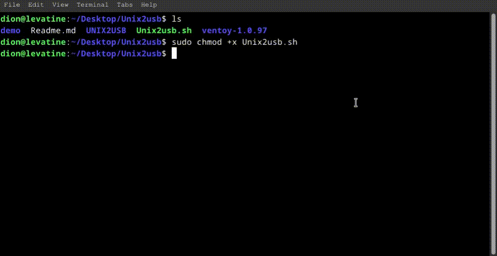
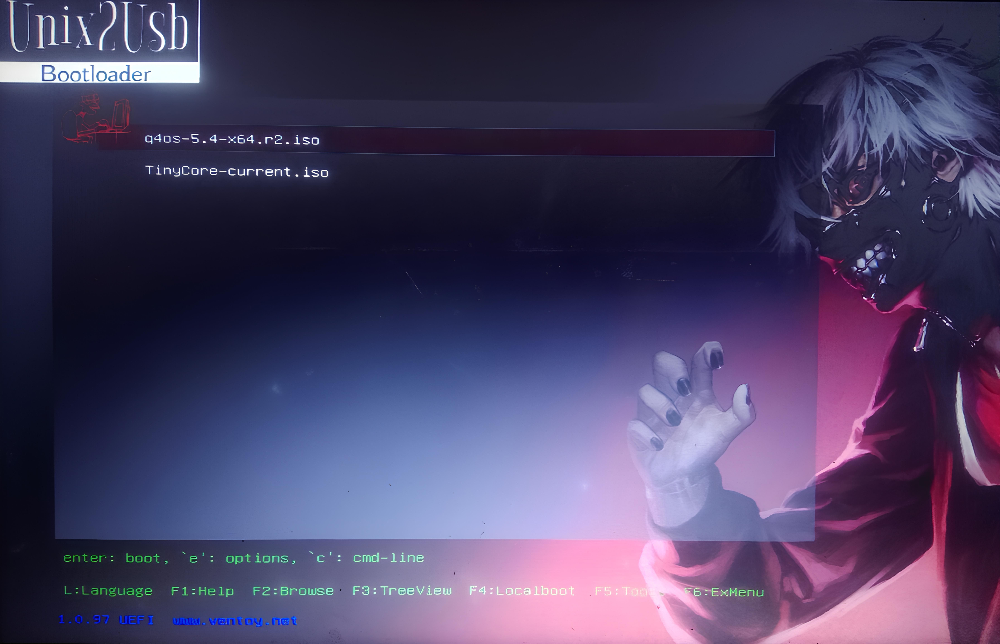

# Unix2usb
---
<div style="width: 850px;">
  
  
</div>

---

Unix2usb is a shell script allows you to create bootable USB drives with ventoy bootloader. It is Fast convenient and easy to use. 

## Usage

1. Clone the repository:
   ```
   git clone https://github.com/d10xi24/Unix2usb.git
   ```
2. Make the script executable:
   ```
   cd Unix2usb && chmod +x Unix2usb.sh
   ```
3. Run the script:
   ```
   ./Unix2usb.sh
   ```
4. Optionally Run the script with appropriate command-line options:
    

    | Option | Description                  |
    |--------|------------------------------|
    | **-i, -I** | *Installation*                 |
    | **-n**    | *Non-destructive installation* |
    | **-u**    | *Update*                       |
    | **-l**    | *Information listing*          |


Follow on-screen prompts and instructions for each operation.

## Features

- Multiboot Support
- Fast and Easy to Use
- ISO drag and drop Support .
- Supports multiple package managers for installing exFAT support(automatically installed if missing)
- Custom Theme :
<p align="center">
  
</p>

# Updates

Here you will find updates and changes made to Unix2usb

### Graphical User Interface (GUI) 

Unix2usb now comes with a graphical user interface (GUI) for a more user-friendly experience. The GUI provides interactive prompts and progress indicators during the installation process.

To use the GUI:
1. Make the script executable: `sudo chmod +x UnixGui.sh`
2. Run the script `./Unix2Gui.sh` as usual.

## License:

This script is licensed under the GNU General Public License (GPL). See the script header for details.

## Conclusion :

This Unix2USB variant allows you to create a Multiboot Bootable USB drive from Linux/Debian/Arch. 
It works by installing Custom theme and configuration files with a Ventoy bootloader. 

Ventoy binary files included in this package can be found [here](https://github.com/ventoy/Ventoy/releases/tag/v1.0.97)

